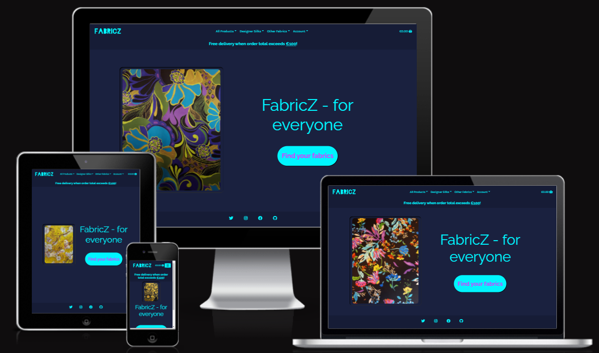
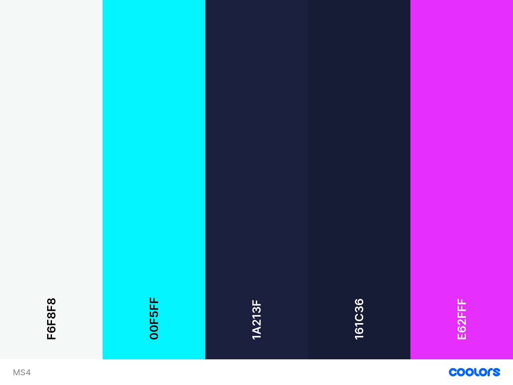

# Ecommerce | Full Stack Frameworks with Django

## Project Overview

This is the fourth milestone project in obtaining a **Full-Stack Web Development Diploma** from  **[Code Institute](https://codeinstitute.net/)**. The purpose of this project is building a full-stack site based around business logic used to control a centrally-owned dataset. Features of the project will include an authentication mechanism, as well as providing paid access to the site's data and/or other activities based on the dataset, such as the purchase of a product or service.

The required main technologies for this project are **HTML**, **CSS**, **Javascript**, **Python** + **Django**, using a relational database (MySQL or Postgres) and using Stripe payments. To improve the overall quality and user experience of the site other technologies were used as well. The full list of technologies used can be found in the technologies section of this document. 

Ecommerce - FabricZ is designed for people who take great pride and joy creating their own clothing. It is our goal to facilitate those people, supplying them with the best quality materials and the most beautiful fabrics. The goal is to build a loyal and growing base of customers, who can easily and intuitively navigate the site prodiving them a positive user experience.  

**Please note: To open any links in this document in a new browser tab, please press CTRL + Click.**


View live website [here](https://fabricz.herokuapp.com/)

---

A mockup of the project, displaying responsiveness.



---

## Table of content

- [Tradeoff table](#tradeoff-table)
- [User experience -UX-](#user-experience--ux-)
  - [User stories](#user-stories)
    - [As a new user](#as-a-new-user)
    - [As a returning user](#as-a-returning-user)
    - [As the site owner/admin](#as-the-site-owner/admin)
  - [Design](#design)
    - [Colour scheme](#colour-scheme)
    - [Typography](#typography)
    - [Styling](#styling)
    - [Wireframes](#wireframes)
    - [Database schema](#database-schema)
- [Features](#features)
  - [Features implemented](#features-implemented)
    - [Navigation](#navigation)
    - [Security](#security)
    - [Managing data](#managing-data)
      - [Update database](#update-database)
      - [Delete product](#delete-cuisine)
      - [Delete product:](#delete-recipe)
      - [Add or edit product](#add-or-edit-recipes)
      - [Product information](#recipe-information)
      - [Profile page](#profile-page)
      - [Stripe payment system](#stripe-payment-system)
    - [Future features](#future-features)
- [Technologies](#technologies)
  - [Databases](#databases)
  - [Languages](#languages)
  - [Libraries and frameworks](#libraries-and-frameworks)
  - [Version control, workspace, repository storage and deployment](#version-control,-workspace,-repository-storage-and-deployment)
  - [Other technologies](#other-technologies)
- [Testing](#testing)
- [Deployment](#deployment)
- [Credits](#credits)
  - [Acknowledgements](#acknowledgements)
- [Disclaimer](#disclaimer)

---


## User Experience -UX-

### User stories

  #### As a new user

- As a new user, I want to immediately understand the purpose of the site	to be able to decide whether to stay or not.
- As a new user, I want to easily browse through fabrics and be able to tell how much they cost and how others have rated them.
- As a new user, I want to create an account easily to be able to purchase products.
- As a new user, I want to add fabrics to my shopping cart before registering to avoid having to register if not necessary.
- As a new user, I want to be able to learn more about a specific fabric to make an informed purchase decision.
- As a new user, I want to filter my search by different criteria to find a specific product.
- As a new user, I want to read reviews/ratings for fabrics to make an informed purchase decision.

[Back to table of content](#table-of-content) 

---
  #### As a returning user

- As a returning user, I want to see if/what fabrics are on sale to find the best value for money.
- As a returning user, I want to have free delivery above an certain order threshold to feel rewarded for larger purchases
- As a returning user, I want to view my previous purchases to be able to make repeat orders more easily.
- As a returning user, I want to review my basket prior to checkout to inspect quantities/products.
- As a returning user, I want to receive confirmation of my order to have proof of purchase.
- As a returning user, I want to save my default delivery details to proceed to the checkout more quickly in the future.
- As a returning user, I want to leave a review and rating for fabrics to inform others about their potential buy.

[Back to table of content](#table-of-content) 

---
  #### As the site owner/admin

- As the owner/admin of the website, I want to be able to view, add, edit and delete products to keep the products list up to date.
- As the owner/admin of the website, I want to manage the attributes assigned to a product so I can correctly display and categorise products.
- As the owner/admin of the website, I want to provide a secure shopping experience so the customers can confidently return to the site.
- As the owner/admin of the website, I want to have a secure payment structure so customers can safely pay.

[Back to table of content](#table-of-content) 

### Design

  #### Colour scheme

  The main colours used for the site are as follows:



- Two darker shades of blue are used for for background.
- The light blue is used mostly for text, headers and links. 
- Purple is used throughout the site for buttons and links that can be clicked, as well as when hoovering over an element.
- The white/gray is used for the search form when active, as well as a background for places in need of some extra contrast.

[Back to table of content](#table-of-content)

---

  #### Typography

[Raleway](https://fonts.google.com/specimen/Raleway?query=raleway) - A relatively slim font used for all headers.

[Karla](https://fonts.google.com/specimen/Karla?query=karla) - A softer and elegant font used for everything other than headings. 

---

  #### Wireframes

Added [Wireframes](https://github.com/nowane/ecommerce/tree/main/docs/wireframes/wireframes.pdf) for desktop, tablet and mobile.

[Back to table of content](#table-of-content)


  #### Database schema

[Diagram schema](https://github.com/nowane/ecommerce/tree/main/docs/database/all_apps_schema.svg) of:

  - Bag
  - Checkout
  - Home
  - Products
  - Profiles

[Diagram schema](https://github.com/nowane/ecommerce/tree/main/docs/database/all_apps_schema.svg) of all apps.

[Back to table of content](#table-of-content)

---

## Features

### Features implemented

  #### Navigation


[Back to table of content](#table-of-content)

---

  #### Security


[Back to table of content](#table-of-content)

---

  #### Managing data

  ##### Update database
  


[Back to table of content](#table-of-content)

---

  ##### Delete product


[Back to table of content](#table-of-content)

---

  ##### Delete product


[Back to table of content](#table-of-content)

---

  #####  Add or edit product
  


[Back to table of content](#table-of-content)

---

  ##### Product information


[Back to table of content](#table-of-content)

  ##### Profile page


[Back to table of content](#table-of-content)

---

### Future features


[Back to table of content](#table-of-content)

---

## Technologies

  ### Databases

- [SQLite](https://www.sqlite.org/index.html) - Used as the database for the creation and development of this project.
- [Heroku Postgres](https://www.heroku.com/postgres) - Used as the database for this project in production mode after deployment to Heroku.

  ### Languages

- [CSS](https://developer.mozilla.org/en-US/docs/Web/CSS) - Used to style and colour HTML as well as dynamic elements.
- [HTML](https://developer.mozilla.org/en-US/docs/Glossary/HTML5) - Used to structure the individual page(s) of the website.
- [Javascript](https://developer.mozilla.org/en-US/docs/Web/JavaScript) - Used to create and manipulate the dynamic elements of the website.
- [Jinja](https://jinja.palletsprojects.com/en/3.0.x/) - Used to generate HTML from templates.
- [Python](https://www.python.org/) - Used for the backend server and to run queries to the database.

[Back to table of content](#table-of-content) 

---

  ### Libraries and frameworks
  
- [Bootstrap v5.1](https://getbootstrap.com/docs/5.1/getting-started/introduction/) - Javascript plugins and CSS toolkit used for this project.
- [Django](https://www.djangoproject.com/) - Python web framework used for this project.
- [Font Awesome](https://fontawesome.com/) - Icons used for this project.
- [Google Fonts](https://fonts.google.com/) - Fonts used for this project.
- [JQuery](https://jquery.com/) - Used to simplify DOM manipulation.

[Back to table of content](#table-of-content) 

---

  ### Version control, workspace, repository storage and deployment

- [AWS](https://aws.amazon.com/) (S3) - Used to store the sites staticfiles.
- [Git](https://git-scm.com/) - Version control software used to commit and push code to the GitHub repository where the source code is stored.
- [Gitpod](https://www.gitpod.io/) - Main workspace IDE (Integrated Development Environment).
- [GitHub](https://github.com/) - Used to store the project repository and deploy the website via github pages.
- [Heroku](https://www.heroku.com/platform) - Platform used to deploy this project.

[Back to table of content](#table-of-content) 

---

  ### Other technologies

- [Balsamiq](https://balsamiq.com/wireframes/) - Used to make wireframes.

- [Coolors](https://coolors.co/) - Used to create a colour schema.

- [Django Graph models](https://django-extensions.readthedocs.io/en/latest/graph_models.html) - Used to visualize the DB

    <details>
    <summary>Description on how to use the graph models</summary>

    In your command line install these packages:
    ```
    pip install django-extensions
    pip install pyparsing pydot
    ```
    Then in 'settings.py' add 'django_extenstions' to your installed apps
    ```
    INSTALLED_APPS = [
      .....
        "django_extensions",
    ]
    Specify default options and select which apps you want to draw
    GRAPH_MODELS = {
      'all_applications': True,
      'group_models': True,
      "app_labels": [
            "app1",
            "app2",
        ],
    }
    ```
    Then in your command line:
    This will create a .dot file containing the code used to draw your diagram from your selected apps in 'GRAPH_MODELS' :

    ```./manage.py graph_models > my_project_name.dot```
    or
    This will creates a .dot file containing the code used to draw your diagram from all your apps:
    ```./manage.py graph_models -a > my_project_name.dot```

    Next go into your 'my_project_name.dot'-file and ```Ctrl + A``` and ```Ctrl + C``` .
    After you've done that head over to this [Website](https://dreampuf.github.io/GraphvizOnline/#digraph%20G%20%7B%0A%0A%20%20subgraph%20cluster_0%20%7B%0A%20%20%20%20style%3Dfilled%3B%0A%20%20%20%20color%3Dlightgrey%3B%0A%20%20%20%20node%20%5Bstyle%3Dfilled%2Ccolor%3Dwhite%5D%3B%0A%20%20%20%20a0%20-%3E%20a1%20-%3E%20a2%20-%3E%20a3%3B%0A%20%20%20%20label%20%3D%20%22process%20%231%22%3B%0A%20%20%7D%0A%0A%20%20subgraph%20cluster_1%20%7B%0A%20%20%20%20node%20%5Bstyle%3Dfilled%5D%3B%0A%20%20%20%20b0%20-%3E%20b1%20-%3E%20b2%20-%3E%20b3%3B%0A%20%20%20%20label%20%3D%20%22process%20%232%22%3B%0A%20%20%20%20color%3Dblue%0A%20%20%7D%0A%20%20start%20-%3E%20a0%3B%0A%20%20start%20-%3E%20b0%3B%0A%20%20a1%20-%3E%20b3%3B%0A%20%20b2%20-%3E%20a3%3B%0A%20%20a3%20-%3E%20a0%3B%0A%20%20a3%20-%3E%20end%3B%0A%20%20b3%20-%3E%20end%3B%0A%0A%20%20start%20%5Bshape%3DMdiamond%5D%3B%0A%20%20end%20%5Bshape%3DMsquare%5D%3B%0A%7D) and paste in the copied code.
    Once that is done, you can select the preferred format of the file to download.
    More information can be found in the [documentation](https://django-extensions.readthedocs.io/en/latest/graph_models.html).
    </details>

- [Favicon](https://favicon.io/) - Used for making the favicons.

- [Gmail](https://mail.google.com/) - Used for order and account information feedback to customer.
    <details>
    <summary>Gmail email setup information</summary>
    ##### Email Setup
    The below instructions cover the setup using a [Gmail](https://mail.google.com) account.

    - Log in to your email account or set one up.
    - Click account settings, and select the 'Accounts and Import' option from the top selection
    - Under 'Change account settings' click 'Other Google Account settings'
    - Click on the 'security' option on the left and then under 'Signing in to Google' click on '2-Step Verification'
    - Click 'get started', enter password and then work through the verification.
    - Once verification is done and 2-Step verification is turned on, a new option now shows under the previous 'Signing in to Google' menu screen.
    - In this, on the App passwords screen, select from the dropdowns; 'mail' for app and 'other' for device. Add an appropriate name and click 'generate'.
    You will then be given a 16 character password which you will need to copy.
    </details>

- [Jpg2png](https://jpg2png.com/) - Used to convert jpg to png.

- [Namecheap](https://www.namecheap.com/) - Used for creating the site logo.

- [Photopea](https://www.photopea.com/) - Used to get rid of the logo's background-colour.

- [StackOverflow](https://stackoverflow.com/) - Used as a general reference resource.

- [Stripe](https://stripe.com/) - Payment infrastructure.
    <details>
    <summary>Stripe payment system setup information</summary>
    - Create a [Stripe](https://stripe.com) account or log in to an existing account.
    - On the Stripe dashboard, under 'Developers' copy the 'test API key' and 'Secret key'. Use these as the values for the environment and Heroku variables STRIPE_PUBLIC_KEY and STRIPE_SECRET_KEY as detailed above. 

      ##### Create new webhook end point.
    **NOTE:** Two separate webhooks will need to be setup. One for the development environment and one for the Heroku app.
    - Run the application to get the address of the site.  Copy this and go to the Stripe dashboard.
    - Click 'Developers', select 'webhooks' and then click 'Add endpoint'.
    - Paste in the site URL and add to the end '/checkout/wh/.
    - Click 'Select Events' and select the events to listen to as:
    ```
      payment_intent.suceeded

      payment_intent.payment_failed
    ```
    - In the newly created webhook endpoint details the `signing secret` is now available. Copy this and add it to the value for the environment and Heroku variable STRIPE_WH_SECRET as detailed above.
    - Recently the option to send a test webhook was lost since Stripe removed this option.

    The STRIPE_CURRENCY variable is defined within the Django app 'settings' python file and is set to 'EUR'.  If a different currency is needed then this will need to be changed. See this link for [supported currencies](https://stripe.com/docs/currencies#presentment-currencies)
    </details>

[Back to table of content](#table-of-content)

---

## Testing

This [testing document](https://github.com/nowane/ecommerce/blob/main/TESTING.md)  contains all testing.

[Back to table of content](#table-of-content)

---

## Deployment

The master branch of this repository is the most current version and has been used for the deployed version of the site. Separate branches were used developing other features.

**Environment variables values and Heroku Config Vars used in the sections below will be unique to each SQLite, Postgres and AWS S3 Bucket created. Please refer to their documentation for further details.**

<details>
<summary> How to clone and run the repository locally</summary>


To clone this project from its [GitHub repository](https://github.com/nowane/ecommerce):
- From the repository, click **Code**.
- In the **Clone > HTTPS** section, copy the clone URL for the repository.
- In your local IDE open Git Bash.
- Change the current working directory to the location where you want the cloned directory to be made.
- Type `git clone`, and then paste the URL you copied earlier.
```console
git clone https://github.com/nowane/ecommerce.git
```
- Press Enter. Your local clone will be created
- Either create a file called `env.py` to hold your app's environment variables, or store the configure environment variables in your IDE. They should contain the following:

```console
import os

os.environ.setdefault("SECRET_KEY", "<App SECRET_KEY of choice>")
os.environ.setdefault("DEVELOPMENT", "True")
os.environ.setdefault('STRIPE_PUBLIC_KEY', '<Key generated by Stripe>')
os.environ.setdefault('STRIPE_SECRET_KEY', '<Key generated by Stripe>')
os.environ.setdefault('STRIPE_WH_SECRET', '<Key generated by Stripe for webhook endpoint>')
```
To find your Stripe keys, login to Stripe - under the **Developers** tab look for the 'Publishable Key' and 'Secret Key'

The webhook secret key can be found under **Webhooks** once you have created an endpoint, which should be set to receive all events and match this url structure:
```
<your site's base url>/checkout/wh/
```
You will need a different endpoint for the local version and deployed site, updating the `STRIPE_WH_SECRET` accordingly in their respective environment variables.

**The following should be listed in your .gitignore file, preventing environment variables accidently being made public:**
```
core.Microsoft*
core.mongo*
core.python*
env.py
__pycache__/
*.py[cod]
*.sqlite3
*.pyc
node_modules/
*.json
```
- Install app requirements using:
```
pip3 install requirements.txt
```
- Apply database migrations using:
```
python3 manage.py migrate
```
- Create a superuser and fill in details:
```
python3 manage.py createsuperuser
```
- The app can now be run locally using:
```
python3 manage.py runserver
```
</details>


<details>
<summary>How to deploy to Heroku</summary>


To deploy the app to Heroku from its [GitHub repository](https://github.com/nowane/ecommerce):
- **Log In** to [Heroku](https://id.heroku.com/login).
- Select **Create new app** from the dropdown in the dashboard.
- Choose a unique name for the app and the location closest by.
- Under **Resources** add **Heroku Postgres** to your app.
- In your CLI install **dj_database_url** and **psycopg2** so you can use Postgres on your deployed site.
```
pip3 install dj_database_url
pip3 install psycopg2
```
- Log into Heroku via the CLI.
```
heroku login -i
```
- Migrate the database into Postgres.
```
heroku run python manage.py migrate
```
- Create a new superuser and fill in your details:
```
python manage.py createsuperuser
```
- Install gunicorn.
```
pip3 install gunicorn
```
- Freeze the app's requirements.
```
pip3 freeze > requirements.txt
```
- Create a **Procfile** and include the following, making sure not to leave a blank line after it:
```
web: gunicorn fabricz.wsgi:application
```
- Temporarily disable Heroku's static file collection.
```
heroku config:set DISABLE_COLLECTSTATIC=1 --app fabricz
```
- Add the hostname of your Heroku app to settings.py.
```
ALLOWED_HOSTS = ['fabricz.herokuapp.com', 'localhost']
```
- Back in Heroku, select the **Deploy** tab and under **Deployment method** choose GitHub.
- In **Connect to GitHub** enter your repository details and click **Connect**.
- Go to the **Settings** tab and under **Config Vars** choose **Reveal Config Vars**.
- Enter the following keys and values, some of which will differ from those in your env.py:

|**Key**|**Value**|
|:-----|:-----|
|AWS_ACCESS_KEY_ID|`<Your Variable>`|
|AWS_SECRET_ACCESS_KEY|`<Your Variable>`|
|DATABASE_URL|`<Added when Postgres is installed>`|
|DISABLE_COLLECTSTATIC|`1` (deleted later on)|
|EMAIL_HOST_PASS|`<Your Variable>`|
|EMAIL_HOST_USER|`<Your Variable>`|
|SECRET_KEY|`<Your Variable>`|
|STRIPE_PUBLIC_KEY|`<Your Variable>`|
|STRIPE_SECRET_KEY|`<Your Variable>`|
|STRIPE_WH_SECRET|`<Different from env.py>`|
|USE_AWS|True|

- Go back to the **Deploy** tab and under **Automatic deploys** choose **Enable Automatic Deploys**.
- Back in your GitPod CLI add, commit and push your changes and Heroku will automatically deploy your app.
```
git add .
git commit -m "Initial commit"
git push
```
- The deployed site can be launched by clicking **Open App** from the Heroku page.

</details>


<details>
<summary>Setting up an AWS S3 Bucket</summary>


- Create an [Amazon AWS](aws.amazon.com) account.
- Search for **S3** and create a new bucket.
  - Allow public access.
  - Acknowledge.
- Under **Properties > Static** website hosting.
  - Enable.
  - Index.html as index document.
  - Save.
- Under **Permissions > CORS** use:
```
[
  {
      "AllowedHeaders": [
          "Authorization"
      ],
      "AllowedMethods": [
          "GET"
      ],
      "AllowedOrigins": [
          "*"
      ],
      "ExposeHeaders": []
  }
]
```
- Under **Permissions > Bucket Policy**:
  - Generate Bucket Policy and take note of **Bucket ARN**.
  - Chose **S3 Bucket Policy** as Type of Policy.
  - For **Principal**, enter `*` .
  - Enter **ARN** noted above.
  - **Add Statement**.
  - **Generate Policy**.
  - Copy **Policy JSON Document**.
  - Paste the policy into **Edit Bucket policy** on the previous tab.
  - Save changes.

- Under **Access Control List (ACL)**:
  - For **Everyone (public access)**, check **List**.
  - Accept that everyone in the world may access the Bucket.
  - Save changes.

</details>


<details>
<summary>Setting up AWS Identity and Access Management</summary>


- From the **IAM dashboard** within AWS, select **User Groups**:
  - Create new group e.g. `manage-fabricz` .
  - Click through without adding a policy.
  - **Create Group**.
- Select **Policies**:
  - Create policy.
  - Under **JSON** tab, click **Import managed policy**.
  - Choose **AmazongS3FullAccess**.
  - Edit resource to include the **Bucket ARN** noted earlier when creating the Bucket Policy:
```
"Resource": [
  "arn:aws:s3:::fabricz",
  "arn:aws:s3:::fabricz/*"
]
```
  - Click **next step** and go to **Review policy**.
  - Give the policy a name e.g. `fabricz-policy` and description.
  - **Create policy**.
- Go back to **User Groups** and choose the group created earlier.
  - Under **Permissions > Add permissions**, choose **Attach Policies** and select the one just created.
  - **Add permissions**.
- Under **Users**:
  - Choose a user name e.g. `fabricz-staticfiles-user` .
  - Select **Programmatic access** as the **Access type**.
  - Click Next.
  - Add the user to the Group just created.
  - Click Next and **Create User**.
- **Download the `.csv` containing the access key and secret access key. This will NOT be available to download again.**

</details>


<details>
<summary>Connecting Django to AWS S3</summary>


- Install boto3 and django-storages.
```
pip3 install boto3
pip3 install django-storages
pip3 freeze > requirements.txt
```
- Add the values from the `.csv` you downloaded to your Heroku Config Vars under settings:
```
AWS_ACCESS_KEY_ID
AWS_SECRET_ACCESS_KEY
```
- Delete the `DISABLE_COLLECTSTATIC` variable from your Config Vars and deploy your Heroku app.
- With the S3 Bucket set up, you can create a new folder called `media` at the same level as the newly added `static` folder. Manually upload any required media files to it, ensure they are publicly accessible under **Permissions**.

</details>

[Back to table of content](#table-of-content)

## Credits

- [noimage.png](https://commons.wikimedia.org/wiki/File:No-image-available.png) - Used with this linking to the license.


[Back to table of content](#table-of-content)

  ---

  ### Acknowledgements

- Thanks to [Chris Zielinski](https://github.com/ckz8780/) for his clear explanation of the Boutique Ado project.

- Thanks to [Emmett Becirovic](https://github.com/bozy15) for posting about the graph models in slack.

- Thanks to my father-in-law for allowing me to use the product images coming directly from the website of his own store [Nanucci Tessuti](https://nanuccitessuti.nl/).

[Back to table of content](#table-of-content)

---

## Disclaimer

This site was developed for educational purposes.

[Back to table of content](#table-of-content)