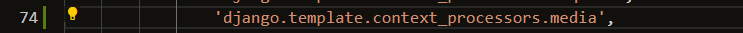
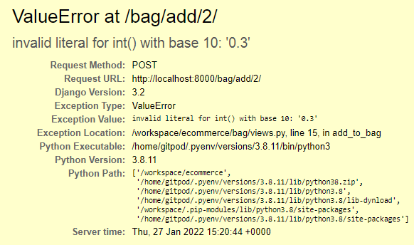
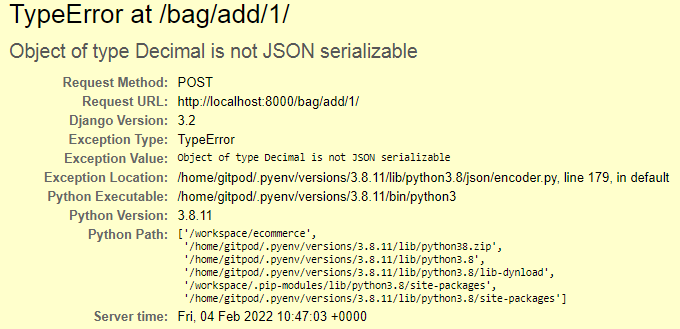

# Testing

## Table of Content

- [Manual testing of each section of the site](#manual-testing-of-each-section-of-the-site)
- [Testing site responsiveness](#testing-site-responsiveness)
    -[Mockup](#mockup)
    -[Lighthouse](#lighthouse)
- [Code validation](#code-validation)
    - [HTML](#html)
    - [CSS](#css)
    - [Javascript](#javascript)
    - [Python](#python)
- [Testing of user stories](#testing-of-user-stories) 
    - [Testing as the site owner/admin](#testing-as-the-site-owner/admin)
    - [Testing as a new user](#testing-as-a-new-user)
    - [Testing as a returning user](#testing-as-a-returning-user)
- [Documentation of any bugs encountered and their resolution steps](#documentation-of-any-bugs-encountered-and-their-resolution-steps)
- [Documentation of any open bugs and other things](#documentation-of-any-open-bugs-and-other-things)

---

## Manual testing of each section of the site

[Back to table of content](#table-of-content)

---

## Testing site responsiveness 

  ### Mockup

A mockup of the project, displaying responsiveness.

[Back to table of content](#table-of-content)

  ### Lighthouse

> This is the added score of the Google DevTools Lighthouse performance for desktop.

[Back to table of content](#table-of-content)

> - This is the added score of the Google DevTools Lighthouse performance for mobile.

[Back to table of content](#table-of-content)

---

## Code validation

### HTML

> Code validated using https://validator.w3.org/ .

[Back to table of content](#table-of-content)

---

### CSS

> Code validated using https://jigsaw.w3.org/css-validator/ .

[Back to table of content](#table-of-content)

---

### Javascript

> Code validated using https://jshint.com/ .

> ES6 was used. 

[Back to table of content](#table-of-content)

---

### Python

> Code validated using http://pep8online.com/ .

[Back to table of content](#table-of-content)

---

## Testing of user stories.

  ### Testing as a new user

[Back to table of content](#table-of-content)

---

  ### Testing as a returning user

[Back to table of content](#table-of-content)

---

  ## Testing as the site owner/admin

[Back to table of content](#table-of-content)

---

## Documentation of any bugs encountered and their resolution steps

- When trying to add the logo to the navigation bar, the image gave a 404 error.

- This was resolved by adding the 'django.template.context_processors.media',  to the templates in settings.py

[Back to table of content](#table-of-content)

- After the site was deployed to Heroku, and all static files got to run via Amazons S3 Bucket, the local site gave 404-errors when loading CSS and JS links. The deployed website however functioned as intended. 

- Checked for typo's in links / checked file paths [like suggested here](https://stackoverflow.com/questions/48248832/stylesheet-not-loaded-because-of-mime-type)
- Tried adding `<base href="/">` in the head before any styling links, like suggested here and at other sites as well.

- Eventually solved by setting `DEBUG = os.environ.get("DEVELOPMENT", True)`

[Back to table of content](#table-of-content)

- At the add_product template, toasts didn't show when adding a new product.

- Eventually I found out that having an empty postload_js block at the bottom of the template prevents the toasts from showing.

[Back to table of content](#table-of-content)

- When adding a product in the card with a quantity if less than 1 metre, the following error occurs.

- ~~Solved by using float() instead if int() to be able to use a decimal value.~~ 

- After adjusting the contexts.py file to iterate through and show the bag items, the following error occured because of different operand types used.

- Solved by making `quantity = Decimal(request.POST.get('quantity'))` in views.py and `total += Decimal(quantity) * product.price` in contexts.py. 

- However when adding to bag the following error occured: "TypeError at /bag/add/1/ Object of type Decimal is not JSON serializable".

[Back to table of content](#table-of-content)

---

## Documentation of any open bugs and other things

- Aware of the fact products.json got commited to GitHub - no user information was committed to GitHub.

- Uncaught {error: 'idpiframe_initialization_failed', details: 'You have created a new client application that use…i/web/guides/gis-migration) for more information.'}
details: "You have created a new client application that uses libraries for user authentication or authorization that will soon be deprecated. New clients must use the new libraries instead; existing clients must also migrate before these libraries are deprecated. See the [Migration Guide](https://developers.google.com/identity/gsi/web/guides/gis-migration) for more information."
error: "idpiframe_initialization_failed"

- The Google login functionality is not yet functional due to the following error:
    "Forbidden (403) - CSRF verification failed. Request aborted."

[Back to table of content](#table-of-content)

[Back to README.md](https://github.com/nowane/ecommerce/blob/main/README.md)

[Back to Repository](https://github.com/nowane/eatspiration)